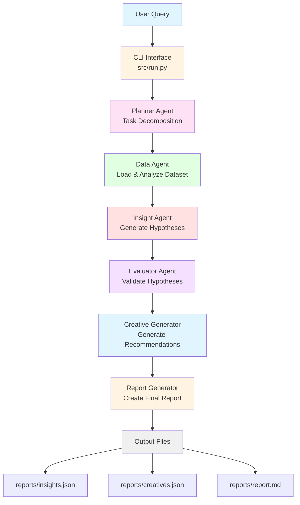

# Kasparro Agent Workflow

This document describes the multi-agent workflow architecture of the Kasparro Facebook Ads Performance Analyst system.

## Agent Workflow Diagram



## Agent Communication Flow

All agents communicate through validated JSON schemas. Each agent:

1. Receives input conforming to its input schema
2. Performs its specialized task
3. Returns output conforming to its output schema
4. Passes control to the next agent via routing instructions

### Communication Envelope

Every agent output follows this standard envelope:

```json
{
  "envelope": {
    "agent_name": "string",
    "timestamp": "ISO 8601 datetime",
    "execution_duration_ms": "integer",
    "status": "success|failure|partial"
  },
  "payload": {
    // Agent-specific output
  },
  "metadata": {
    "config_version": "string",
    "dataset_hash": "string"
  }
}
```

## Agent Descriptions

### 1. Planner Agent

**Location:** `src/agents/planner.py`  
**Prompt:** `prompts/planner_prompt.md`

**Purpose:** Orchestrates the workflow by parsing natural language queries and decomposing them into executable tasks.

**Input:**

- Natural language query from user
- Dataset path
- Configuration object

**Output:**

- Task decomposition plan
- Date range extraction
- Routing instructions for next agent
- Workflow type (analysis|creative_generation|full)

**Key Responsibilities:**

- Parse user intent from natural language
- Extract time ranges and parameters
- Generate ordered task execution plan
- Determine workflow routing

**Example Query:** "Analyze ROAS changes in the last 7 days"

**Example Output:**

```json
{
  "task": "roas_analysis",
  "date_range": { "from": "2024-01-08", "to": "2024-01-14" },
  "steps": ["load_data", "generate_hypothesis", "validate", "report"],
  "routing": { "next_agent": "data_agent", "workflow_type": "full" }
}
```

---

### 2. Data Agent

**Location:** `src/agents/data_agent.py`  
**Prompt:** `prompts/data_agent_prompt.md`

**Purpose:** Loads, validates, and analyzes the Facebook Ads dataset.

**Input:**

- Dataset path (CSV file)
- Date range filter
- Metrics to compute
- Configuration parameters

**Output:**

- Dataset summary statistics
- Computed metrics (ROAS, CTR, CVR, CPC)
- Trend analysis (WoW, MoM changes)
- Segmentation by campaign, creative type, audience, platform
- Data quality report

**Key Responsibilities:**

- Load and validate CSV data
- Compute aggregated performance metrics
- Calculate trend changes and classify direction
- Segment data by multiple dimensions
- Report data quality issues
- Cache dataset for subsequent agents

**Example Output:**

```json
{
  "summary": {
    "rows": 1280,
    "date_range": ["2024-01-01", "2024-02-15"],
    "total_spend": 51452.2,
    "total_revenue": 124898.33,
    "mean_roas": 2.43,
    "mean_ctr": 0.0121
  },
  "trends": {
    "roas_trend": {
      "direction": "decreasing",
      "week_over_week_change": -4.7,
      "month_over_month_change": -8.2
    }
  }
}
```

---

### 3. Insight Agent

**Location:** `src/agents/insight_agent.py`  
**Prompt:** `prompts/insight_agent_prompt.md`

**Purpose:** Generates hypotheses explaining ROAS or CTR changes based on data patterns.

**Input:**

- Data summary from Data Agent
- Focus metric (e.g., "roas")
- Time period
- Configuration

**Output:**

- 3-5 distinct hypotheses
- Initial confidence scores (0-1)
- Supporting observations
- Hypothesis categories (creative, audience, platform, budget, seasonality)
- Validation approach for each hypothesis

**Key Responsibilities:**

- Analyze data patterns and trends
- Generate testable hypotheses
- Assign initial confidence scores
- Categorize hypotheses by type
- Provide reasoning structure (Think-Analyze-Conclude)

**Example Output:**

```json
{
  "hypotheses": [
    {
      "hypothesis_id": "h1",
      "hypothesis_text": "CTR drop in male 18-24 segment caused ROAS decline",
      "category": "audience",
      "initial_confidence": 0.63,
      "supporting_observations": [
        "Male 18-24 CTR dropped 24%",
        "ROAS declined 17% in same period"
      ],
      "testable": true
    }
  ]
}
```

---

### 4. Evaluator Agent

**Location:** `src/agents/evaluator_agent.py`  
**Prompt:** `prompts/evaluator_agent_prompt.md`

**Purpose:** Validates hypotheses using quantitative metrics and statistical analysis.

**Input:**

- Hypotheses from Insight Agent
- Dataset path
- Data summary
- Configuration

**Output:**

- Validated hypotheses with evidence
- Adjusted confidence scores
- Statistical significance metrics (p-values, confidence intervals)
- Hypothesis ranking by validation strength
- Top 3 insights for reporting

**Key Responsibilities:**

- Compute validation metrics for each hypothesis
- Compare performance across segments
- Perform statistical significance testing
- Adjust confidence scores based on evidence
- Rank hypotheses by validation strength
- Apply weighted confidence formula: (InsightConfidence × 0.4) + (ValidationStrength × 0.4) + (SegmentationEvidence × 0.2)

**Example Output:**

```json
{
  "validated_hypotheses": [
    {
      "hypothesis_id": "h1",
      "hypothesis_text": "CTR drop in male 18-24 segment caused ROAS decline",
      "validation_status": "confirmed",
      "evidence": {
        "metrics": [
          { "metric_name": "ctr_change", "value": -24.2 },
          { "metric_name": "roas_change", "value": -17.1 }
        ],
        "statistical_significance": { "p_value": 0.041 }
      },
      "adjusted_confidence_score": 0.82
    }
  ]
}
```

---

### 5. Creative Generator

**Location:** `src/agents/creative_generator.py`  
**Prompt:** `prompts/creative_generator_prompt.md`

**Purpose:** Generates new ad creative recommendations for low-CTR campaigns.

**Input:**

- Data summary from Data Agent
- Low CTR threshold from configuration
- Dataset path
- Configuration

**Output:**

- Creative recommendations for each low-CTR campaign
- 3+ creative variations per campaign
- Creative attributes (message, type, audience, rationale)
- Confidence scores for each recommendation
- Expected CTR improvement estimates

**Key Responsibilities:**

- Identify campaigns below CTR threshold
- Analyze high-performing vs low-performing creative patterns
- Generate creative variations with rationale
- Assign confidence scores based on historical patterns
- Provide actionable creative recommendations

**Example Output:**

```json
{
  "recommendations": [
    {
      "campaign_name": "Undergarments_Male_18-24",
      "current_ctr": 0.0087,
      "new_creatives": [
        {
          "creative_type": "carousel",
          "creative_message": "Minimalist athletic cotton stretch — Buy 1 Get 1",
          "audience_type": "male_18_24_interest_fitness",
          "rationale": "Carousel format shows 35% higher CTR for this demographic",
          "confidence_score": 0.78,
          "expected_ctr_improvement": 0.0032
        }
      ]
    }
  ]
}
```

---

### 6. Report Generator

**Location:** `src/agents/report_generator.py`

**Purpose:** Synthesizes all agent outputs into a cohesive Markdown report for stakeholders.

**Input:**

- Validated insights from Evaluator
- Creative recommendations from Creative Generator
- Data summary from Data Agent
- Original user query

**Output:**

- Markdown report file (reports/report.md)

**Report Sections:**

1. Executive Summary
2. Key Insights (top 3 validated hypotheses)
3. Creative Recommendations
4. Methodology

**Key Responsibilities:**

- Aggregate outputs from all agents
- Format data for stakeholder readability
- Generate proper Markdown structure
- Include supporting metrics and confidence scores
- Provide actionable recommendations

---

## Data Flow Example

### User Query

```
"Analyze ROAS performance for the last 14 days and suggest creative improvements"
```

### Step-by-Step Execution

1. **Planner Agent** parses query:

   - Extracts date range: last 14 days
   - Identifies tasks: ROAS analysis + creative generation
   - Routes to Data Agent

2. **Data Agent** processes dataset:

   - Loads synthetic_fb_ads_undergarments.csv
   - Filters to last 14 days
   - Computes ROAS: 2.43 → 2.21 (-9%)
   - Identifies CTR drop in male 18-24 segment
   - Passes summary to Insight Agent

3. **Insight Agent** generates hypotheses:

   - H1: Male 18-24 CTR drop caused ROAS decline (confidence: 0.63)
   - H2: Image creative fatigue in female segments (confidence: 0.58)
   - H3: Platform shift from Instagram to Facebook (confidence: 0.51)
   - Passes hypotheses to Evaluator

4. **Evaluator Agent** validates:

   - H1: Confirmed with p-value 0.041, adjusted confidence: 0.82
   - H2: Partially confirmed, adjusted confidence: 0.67
   - H3: Rejected, adjusted confidence: 0.34
   - Passes top insights to Creative Generator

5. **Creative Generator** produces recommendations:

   - Identifies 3 campaigns with CTR < 0.01
   - Generates 3 creative variations per campaign
   - Focuses on male 18-24 and female 25-34 segments
   - Passes recommendations to Report Generator

6. **Report Generator** creates final output:
   - Writes insights.json with validated hypotheses
   - Writes creatives.json with recommendations
   - Writes report.md with executive summary

### Final Outputs

**reports/insights.json:**

```json
{
  "top_insights": [
    {
      "hypothesis": "Male 18-24 CTR drop caused ROAS decline",
      "validated_confidence": 0.82,
      "evidence": { "ctr_change": -24.2, "roas_change": -17.1 }
    }
  ]
}
```

**reports/creatives.json:**

```json
{
  "recommendations": [
    {
      "campaign": "Undergarments_Male_18-24",
      "creative": "Minimalist athletic cotton stretch — Buy 1 Get 1",
      "confidence": 0.78
    }
  ]
}
```

**reports/report.md:**

```markdown
# Facebook Ads Performance Analysis

## Executive Summary

ROAS declined 9% over the last 14 days, primarily driven by a 24% CTR drop
in the male 18-24 segment...

## Key Insights

1. Male 18-24 CTR drop caused ROAS decline (Confidence: 82%)
   - Supporting metrics: CTR -24.2%, ROAS -17.1%
   - Statistical significance: p-value 0.041

## Creative Recommendations

- Campaign: Undergarments_Male_18-24
  - New Creative: "Minimalist athletic cotton stretch — Buy 1 Get 1"
  - Expected CTR improvement: +0.32%
  - Confidence: 78%
```

---

## Error Handling

Each agent implements error handling at multiple levels:

1. **Input Validation:** Schema validation before processing
2. **Execution Errors:** Try-catch with retry logic (exponential backoff)
3. **Output Validation:** Schema validation before returning
4. **Error Propagation:** Structured error messages in standard envelope

**Error Response Format:**

```json
{
  "envelope": {
    "agent_name": "data_agent",
    "status": "failure",
    "error": {
      "error_type": "ValidationError",
      "error_message": "Missing required field: campaign_name",
      "error_details": { "field": "campaign_name", "row": 42 }
    }
  }
}
```

---

## Configuration

All agents share a common configuration loaded from `config/config.yaml`:

```yaml
thresholds:
  low_ctr: 0.01
  high_confidence: 0.7
  roas_change_significant: 0.15

agents:
  max_hypotheses: 5
  min_data_points: 10

retry:
  max_retries: 3
  backoff_multiplier: 2

logging:
  level: "INFO"
  format: "json"

random_seed: 42
```

---

## Extending the System

### Adding a New Agent

1. Create agent class in `src/agents/new_agent.py`
2. Define input/output schemas in `src/schemas/agent_io.py`
3. Create agent prompt in `prompts/new_agent_prompt.md`
4. Register agent in `src/agents/__init__.py`
5. Update routing logic in Planner Agent
6. Add agent to workflow in `src/run.py`

### Adding New Metrics

1. Update Data Agent metric computation
2. Add metric to data summary schema
3. Update Insight Agent to use new metric
4. Update Evaluator Agent validation logic
5. Document metric in design.md

---

## Performance Considerations

- **Dataset Caching:** Data Agent caches loaded dataset in memory for all subsequent agents
- **Lazy Loading:** Agent prompts loaded only when agent is instantiated
- **Parallel Execution:** Independent agents (Insight + Creative) can run in parallel
- **Streaming Logs:** Logs written incrementally to avoid memory buildup

---

## Testing

Each agent has comprehensive test coverage:

- **Unit Tests:** Test individual agent methods
- **Property-Based Tests:** Test agent behavior across random inputs
- **Integration Tests:** Test full workflow end-to-end
- **Schema Tests:** Validate all input/output schemas

See `tests/` directory for complete test suite.
